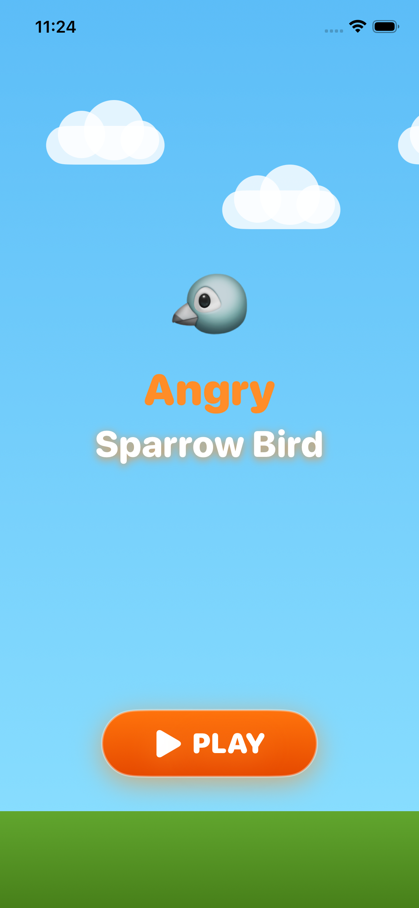

# 🐦 Angry Sparrow Bird Game App

  

---

## 🎮 About Game

**Angry Sparrow Bird** is a physics-based 2-stage iOS game built using **SwiftUI**.  
Players launch an angry sparrow bird to destroy obstacles and enemies using realistic motion and collisions.

---

## 🧩 Game Stages

### 🟢 Stage 1 – Beginner
- Wooden blocks
- Single bird
- Easy physics
- Score-based progress

### 🔴 Stage 2 – Advanced
- Wooden + stone blocks
- Multiple birds
- Higher gravity
- Enemy targets

---

## 🛠 Tech Stack
- **Language:** Swift
- **UI Framework:** SwiftUI
- **Architecture:** MVVM
- **Physics:** Custom logic
- **Platform:** iOS

---

## 🚀 How to Run
1. Clone the repo
2. Open `AngrySparrowbird.xcodeproj`
3. Run on iPhone Simulator

---

## 👨‍💻 Author
Awadhesh Singh Kushwaha
